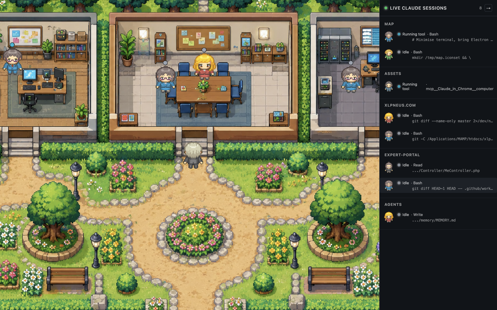

# Claude Workspace Map

**A living RPG map of your Claude Code sessions.**

Watch your AI agents move through pixel-art offices in real time — coding, planning, waiting for input, spawning sub-agents. Instead of switching between terminals to check what each Claude is doing, glance at the map.

> Built for developers who run multiple Claude Code sessions in parallel and want a single, delightful view of what's happening.

---

## What it looks like

<!-- TODO: add demo GIF here -->
<!-- Suggested: 30s screen recording showing agents moving, status changes, dialogue bubbles -->



---

## Features

- **Live agent tracking** — reads `~/.claude/projects/**/*.jsonl` with zero config; every session appears as a character on the map within seconds
- **Status-aware NPCs** — behaviour and overlays change with agent status: `coding`/`running_tool`/`planning` stand still and show a persistent tool-detail bubble; `awaiting_approval` shows a bouncing `?` glyph; `blocked` shows a `!`
- **RPG dialogue (`E` key)** — walk up to any NPC and press `E` to open a speech bubble with their current status and tool. On `awaiting_approval` NPCs: a full RPG panel shows the pending plan or questions — `[Y]`/`[N]` to approve/reject a plan, `[1–4]` to answer a question, `[T]` to open the terminal, all written directly to the agent's PTY
- **Persistent activity bubbles** — while an agent is coding or running tools, a live bubble above their head shows exactly what file or command they're touching, updating in real time
- **Sub-agent lifecycle** — spawned agents appear as student NPCs, work, and fade when done
- **A\* pathfinding** — agents navigate around obstacles on a real collision grid; no more clipping through walls
- **PTY launcher** — spawn a new Claude Code session from the sidebar ⚡ button, or open a terminal for any existing session; the in-game `[T]` shortcut links directly into the sidebar terminal
- **Sidebar HUD** — full list of active sessions with status, project name, last tool; inline approval widget for plans and questions; desktop notifications on `awaiting_approval` / `blocked` transitions; per-agent `×` dismiss and bulk 🧹 clear
- **Instant hooks** — optional Claude Code hooks fire a `POST /api/hook` for immediate `awaiting_approval` / `SessionEnd` updates (no polling lag)
- **Electron app** — ships as a `.dmg` / `.AppImage`; double-click to launch, no `npm run dev` required
- **Auto-update** — the app checks for new releases on GitHub and prompts to install in one click

---

## Quick start

### Option A — Desktop app (recommended)

Download the latest release for your platform from the [Releases](../../releases) page:

| Platform | File |
|---|---|
| macOS Apple Silicon | `Claude-Workspace-Map-arm64.dmg` |
| macOS Intel | `Claude-Workspace-Map-x64.dmg` |
| Linux | `Claude-Workspace-Map-x86_64.AppImage` |

Open the app. It starts the server automatically on `localhost:4000` and watches `~/.claude/projects/` immediately.

### Option B — From source

```bash
git clone https://github.com/guillaumeArgiles/claude-workspace-map.git
cd claude-workspace-map
npm install

# Web mode (opens in your browser)
npm run dev

# Electron mode (opens as a desktop window)
npm run dev:electron
```

Requires **Node 22+**.

---

## Optional: instant status updates via hooks

By default the app tails JSONL files. For two extra signals — *awaiting human input* and *session ended* — add these hooks to `~/.claude/settings.json`:

```json
{
  "hooks": {
    "Notification": [
      {
        "matcher": "",
        "hooks": [
          {
            "type": "command",
            "command": "curl -sf -X POST -H 'Content-Type: application/json' -d @- http://localhost:4000/api/hook >/dev/null 2>&1 || true"
          }
        ]
      }
    ],
    "SessionEnd": [
      {
        "matcher": "",
        "hooks": [
          {
            "type": "command",
            "command": "curl -sf -X POST -H 'Content-Type: application/json' -d @- http://localhost:4000/api/hook >/dev/null 2>&1 || true"
          }
        ]
      }
    ]
  }
}
```

Restart open Claude Code sessions to pick up the new settings. The `|| true` guard ensures the hook never blocks a Claude turn when the map is offline.

See [`docs/HOOKS_SETUP.md`](docs/HOOKS_SETUP.md) for more detail.

---

## How it works

```
~/.claude/projects/**/*.jsonl
        │  (chokidar watcher)
        ▼
  Node HTTP server  ──── POST /api/hook  ◄── Claude Code hooks
        │  ├── GET  /api/events (SSE)         (Notification, SessionEnd)
        │  ├── POST /api/sessions             spawn PTY
        │  ├── POST /api/sessions/:id/write   send input to PTY
        │  └── GET  /api/sessions/by-session/:sessionId  PTY↔session link
        ▼
  React + Phaser 3 renderer
        │
        ├── AgentSyncer      maps session state → NPC instances
        ├── NpcManager       sprite lifecycle, status overlays, activity bubbles
        ├── PlayerController  movement, E-key routing, A* autopilot
        ├── DialogueUI       generic speech bubble (E on any NPC)
        ├── RPGApprovalUI    plan/question panel (E on awaiting_approval NPC)
        └── CollisionLayer   physics bodies from collisions.json
```

Each `.jsonl` file is one Claude Code session. The watcher reads new bytes as they appear, parses each line with Zod, derives agent status from tool-use patterns, and broadcasts `agent_spawned / agent_updated / agent_removed` events over SSE.

---

## Tech stack

| Layer | Tech |
|---|---|
| Renderer | [Phaser 3](https://phaser.io) + React 18 + TypeScript |
| Build | Vite 5 + electron-vite |
| Desktop | Electron 42 + electron-builder |
| Server | Node.js `http` (no framework) |
| Watching | chokidar 5 |
| Validation | Zod 4 |
| Logging | pino + pino-pretty |
| Tests | Vitest (68 specs) |
| CI | GitHub Actions (typecheck + tests on every PR) |

---

## Roadmap

The project follows a 12-sprint roadmap toward a full multi-session orchestration layer.

**Phase 1 — Foundation (done)**
- [x] Modular Phaser scene (NpcManager, AgentSyncer, PlayerController, …)
- [x] Robust SSE reconnect + React error boundary
- [x] Structured logging (pino), strict TypeScript, Zod validation
- [x] 68 automated tests, CI on GitHub Actions
- [x] A\* pathfinding grid (24 px cells, 8-direction, line-of-sight smoothing)
- [x] Electron packaging — `.dmg` (arm64 + x64) + `.AppImage`
- [x] Auto-update via GitHub Releases

**Phase 2 — Talk to agents** *(in progress)*
- [x] PTY launcher — spawn and control Claude sessions from the map sidebar
- [x] RPG approval dialogue — press `E` on a waiting NPC to approve plans or answer questions directly from the map
- [x] Persistent activity bubbles — real-time tool-detail above each NPC while coding
- [x] NPC behaviour by status — pinned during active work, bouncing `?` on approval wait
- [ ] Chat panel — send free-text messages to any running agent
- [ ] Proactive master agent — when all sessions are idle, suggests tasks, asks about your project, preps your day

**Phase 3 — Team mode** *(planned)*
- [ ] Cloud sync — see teammates' agents on the same map
- [ ] Multi-machine view
- [ ] Pricing (free local, Pro team sync)

---

## Development

```bash
npm run dev            # Vite dev server + Node server (browser)
npm run dev:electron   # Vite + Node server + Electron window
npm run typecheck      # tsc --noEmit
npm test               # vitest run
npm run build          # electron-vite build (prod bundles)
npm run package:dir    # build + package to release/ (unpacked, no signing)
```

See [`docs/SPRINTS.md`](docs/SPRINTS.md) for the sprint history and [`docs/BACKLOG.md`](docs/BACKLOG.md) for the full product backlog.

---

## Credits

Character sprites: **[Pipoya — Free RPG Character Sprites 32×32](https://pipoya.itch.io/pipoya-free-rpg-character-sprites-32x32)**, obtained via [clkao/swonline](https://github.com/clkao/swonline).

See [CREDITS.md](CREDITS.md) for the full attribution list.

---

## License

[AGPL v3](LICENSE) — free to use, fork, and contribute. If you run a modified version as a network service, you must publish your source. Commercial licensing available — contact the author.

See [CONTRIBUTING.md](CONTRIBUTING.md) for contribution guidelines.
