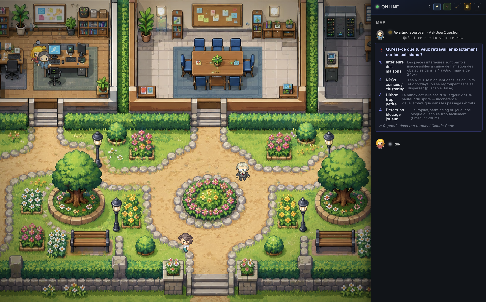
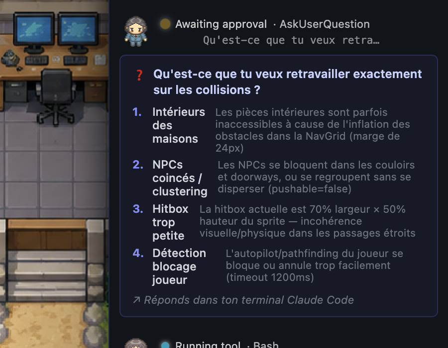
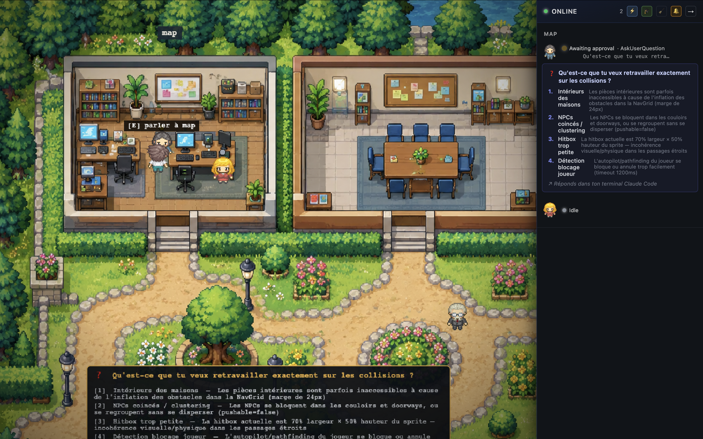
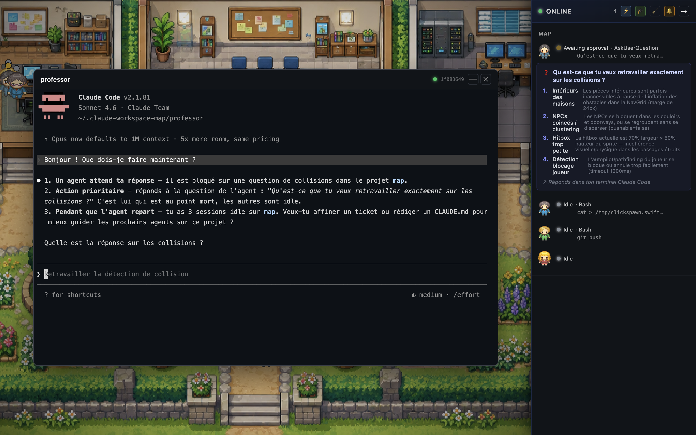
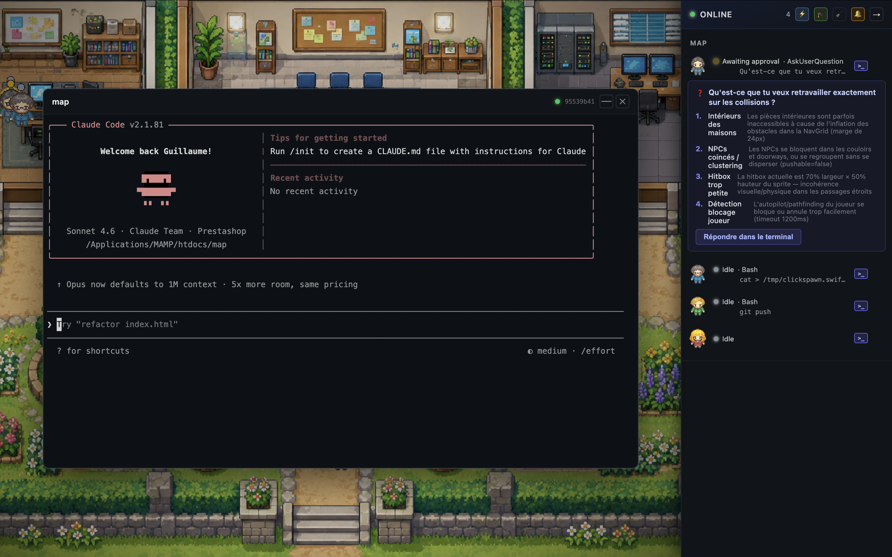
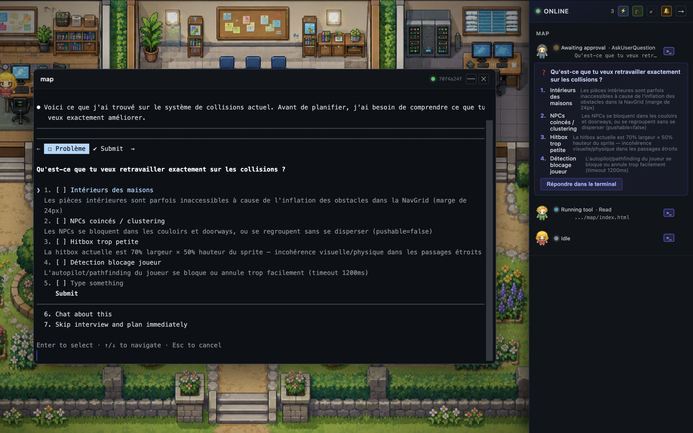
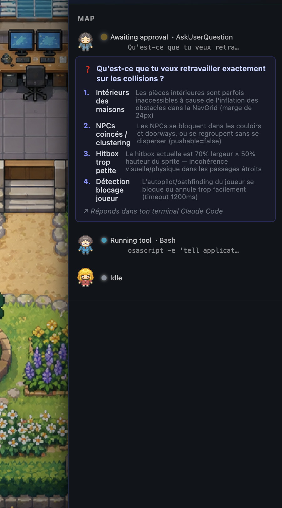

# Claude Workspace Map

**A living RPG map of your Claude Code sessions.**

Watch your AI agents move through pixel-art offices in real time — coding, planning, waiting for input, spawning sub-agents. Instead of switching between terminals to check what each Claude is doing, glance at the map.

> Built for developers who run multiple Claude Code sessions in parallel and want a single, delightful view of what's happening.

---



*Live view: three active sessions on the map — one awaiting your answer (yellow ?), two coding (blue glow). The sidebar shows their status, current tool, and an inline approval widget.*

---

## Features

### Live agent tracking

Every Claude Code session under `~/.claude/projects/` appears automatically as an NPC on the map within seconds — no config needed. The watcher tails `.jsonl` files in real time.

### Status-aware NPCs

Each agent's sprite reacts to what they're doing:

| Status | Behaviour |
|---|---|
| `coding` / `running_tool` | Stands still, persistent activity bubble above head |
| `planning` | Slow idle animation |
| `awaiting_approval` | Bouncing `?` glyph |
| `blocked` | Red `!` glyph |
| `idle` | Wanders the office |

---

### Inline approval widget

When an agent calls `ExitPlanMode` or `AskUserQuestion`, the sidebar shows a structured widget so you can respond without leaving the map.



Radio options for `AskUserQuestion`, `[Y]` / `[N]` for plan approval — responses are written directly to the agent's PTY.

---

### RPG dialogue — press `E` near any NPC

Walk up to an agent and press `E`. A speech bubble opens with their current status and tool. On `awaiting_approval` agents, a full RPG panel appears at the bottom of the screen:



The panel renders the pending question with all options. Press `[1–4]` to select a choice, `[Y]`/`[N]` to approve or reject a plan, `[T]` to open the terminal — all written directly to the agent's PTY.

---

### The Professor — AI orchestrator

Press `P` or click 🎓 to spawn the Professor: a dedicated Claude Code session that reads your map state and tells you what needs attention right now.



The Professor opens as a floating terminal overlay, greets you, and immediately briefs you: which agent is blocked, what question to answer, and what you could do while waiting. It's a second brain watching your fleet.

---

### PTY terminal overlay

Click any agent row, or press `[T]` in the RPG dialogue, to open a full terminal for that session directly in the map.



The terminal is a real Claude Code PTY — you can type, approve, cancel, or inspect — without leaving the map window. The `×` button closes it, `—` minimises it to the sidebar.

---

### AskUserQuestion in terminal

When an agent calls `AskUserQuestion`, the multi-select widget also appears natively in the terminal overlay so you can respond from either interface:



---

### Sidebar HUD

The right panel gives a full operational view of your fleet:



- Status badge + current tool for every session
- Inline `[Y]`/`[N]` plan approval and `[1–4]` question answers
- `>_` button per agent to open its terminal
- `×` to dismiss a finished agent, `Backspace` to bulk-clear all done/idle
- Desktop notifications on `awaiting_approval` / `blocked` transitions

---

### Command palette — `⌘K` / `Ctrl+K`

A VS Code-style palette is the single entry point to every action and every running agent. Type to fuzzy-match, ↑↓ to navigate, ↵ to act.

- **Actions** — `New Claude session`, `Summon the Professor`, `Open Settings`, `View workspace stats`, `Enable desktop notifications`, `Clear N inactive agents`. Each action shows its keyboard shortcut as a discoverable hint.
- **Agents** — every live session appears as a sidebar-style row (sprite, status, sub-agents, pending-approval widget, dismiss × on hover) grouped by project. Search matches on project name, status, tool, tool detail, sessionId.

The palette doubles as a keyboard cheat-sheet — no more guessing what `B` or `,` does.

---

### Agent context menu — `Space`

Walk up to any agent and press `Space` for a quick-action RPG menu — five gated actions on a single row:

| Key | Action | When |
|---|---|---|
| `[1]` | Open conversation | always |
| `[2]` | View plan | only if a plan is pending |
| `[3]` | Ask a question (`/btw`) | only if a PTY is linked |
| `[4]` | Work faster (`/fast` + whip animation) | only if a PTY is linked |
| `[5]` | Kill the agent (with death animation) | always |

Each action writes directly to the agent's PTY — no terminal switching.

---

### Drag-and-drop NPCs

Grab any agent on the map and drop them on a different house to move that Claude session into another project room. The teacher walks home, the room banner updates, and the next NPC inherits the slot.

A bidirectional palette → map drag also works: drag a project group from the palette onto a building.

---

### Workspace insights — `D`

Local-only dashboard computed straight from your `~/.claude/projects/*.jsonl` files — no telemetry, no event collection.

- **Sessions / Tokens / Tool calls / Plans accepted** KPIs (compact `Intl.NumberFormat`-formatted)
- **Sessions per day** line chart
- **Top tools** bar chart
- **Top projects by sessions** pie chart
- Filter by project, range `7 days / 30 days / All time`

Reads JSONL incrementally — opening the dashboard is instant even with months of history.

---

### Settings panel — `,`

Persisted in `~/.claude-workspace-map/config.json`:

- **Theme** — dark / light, live preview
- **Sidebar width** — 200–600 px, live preview
- **Server port** — read-only (restart to change)
- **Language** — English / Français / Español, switches the entire UI instantly

---

### Multilingual — EN / FR / ES

Every label, button, dialogue line, status badge and dashboard chart title is translatable. The first-run locale is auto-detected from `navigator.language`; switching it in Settings updates the whole app (React UI + Phaser dialogues) on the fly.

Numbers and dates respect the locale (`8.2B` in English → `8,2 Md` in French → `8158,9 M` in Spanish). Plurals are computed with `Intl.PluralRules`.

---

### A\* pathfinding

Agents navigate around furniture and walls on a 24 px collision grid — no more clipping through desks. The player's autopilot (click-to-walk) uses the same grid with line-of-sight smoothing.

---

### PTY launcher

Press `N` or click ⚡ to spawn a new Claude Code session from any project directory. Recent directories are listed for quick relaunch.

---

### Sub-agent lifecycle

Agents spawned by `Agent(…)` tool calls appear as student NPCs, work alongside their parent, and fade when their task is done.

---

### Keyboard shortcuts

| Key | Action |
|---|---|
| `⌘K` / `Ctrl+K` | Open command palette |
| `N` | Open spawn panel |
| `P` | Spawn / open Professor |
| `E` | Talk to nearest NPC |
| `Space` | Open agent context menu (terminal / plan / btw / fast / kill) |
| `Tab` | Cycle player through agents |
| `1` / `2` / `3` | Jump player to house 1 / 2 / 3 |
| `D` | Open workspace insights dashboard |
| `,` | Open Settings |
| `S` | Toggle sidebar list |
| `B` | Request desktop notification permission |
| `Backspace` | Bulk clear idle/done agents |
| `Escape` | Close terminal / dismiss dialogue / close palette |

---

## Quick start

### Option A — Desktop app (recommended)

Download the latest release for your platform from the [Releases](../../releases) page:

| Platform | File |
|---|---|
| macOS Apple Silicon | `Claude-Workspace-Map-arm64.dmg` |
| macOS Intel | `Claude-Workspace-Map-x64.dmg` |
| Linux | `Claude-Workspace-Map-x86_64.AppImage` |

Open the app. It starts the server on `localhost:4000` and watches `~/.claude/projects/` automatically.

### Option B — From source

```bash
git clone https://github.com/guillaumeArgiles/claude-workspace-map.git
cd claude-workspace-map
npm install

# Web mode (browser)
npm run dev

# Electron mode (desktop window)
npm run dev:electron
```

Requires **Node 22+**.

---

## Optional: instant status updates via hooks

By default the app tails JSONL files. For two extra signals — *awaiting human input* and *session ended* — add these hooks to `~/.claude/settings.json`:

```json
{
  "hooks": {
    "Notification": [
      {
        "matcher": "",
        "hooks": [
          {
            "type": "command",
            "command": "curl -sf -X POST -H 'Content-Type: application/json' -d @- http://localhost:4000/api/hook >/dev/null 2>&1 || true"
          }
        ]
      }
    ],
    "SessionEnd": [
      {
        "matcher": "",
        "hooks": [
          {
            "type": "command",
            "command": "curl -sf -X POST -H 'Content-Type: application/json' -d @- http://localhost:4000/api/hook >/dev/null 2>&1 || true"
          }
        ]
      }
    ]
  }
}
```

Restart open Claude Code sessions to pick up the new settings. The `|| true` guard ensures the hook never blocks a Claude turn when the map is offline.

See [`docs/HOOKS_SETUP.md`](docs/HOOKS_SETUP.md) for more detail.

---

## How it works

```
~/.claude/projects/**/*.jsonl
        │  (chokidar watcher)
        ▼
  Node HTTP server  ──── POST /api/hook  ◄── Claude Code hooks
        │  ├── GET  /api/events (SSE)         (Notification, SessionEnd)
        │  ├── POST /api/sessions             spawn PTY
        │  ├── POST /api/sessions/:id/write   send input to PTY
        │  ├── GET  /api/sessions/by-session/:sessionId  PTY↔session link
        │  └── POST /api/professor/spawn      Professor session
        ▼
  React + Phaser 3 renderer
        │
        ├── AgentSyncer      maps session state → NPC instances
        ├── NpcManager       sprite lifecycle, status overlays, activity bubbles
        ├── PlayerController  movement, E-key routing, A* autopilot
        ├── DialogueUI       generic speech bubble (E on any NPC)
        ├── RPGApprovalUI    plan/question panel (E on awaiting_approval NPC)
        └── CollisionLayer   physics bodies from collisions.json
```

Each `.jsonl` file is one Claude Code session. The watcher reads new bytes as they appear, parses each line with Zod, derives agent status from tool-use patterns, and broadcasts `agent_spawned / agent_updated / agent_removed` events over SSE.

---

## Tech stack

| Layer | Tech |
|---|---|
| Renderer | [Phaser 3](https://phaser.io) + React 18 + TypeScript |
| Build | Vite 5 + electron-vite |
| Desktop | Electron 42 + electron-builder |
| Server | Node.js `http` (no framework) |
| Watching | chokidar 5 |
| Validation | Zod 4 |
| Logging | pino + pino-pretty |
| Tests | Vitest (68 specs) |
| CI | GitHub Actions (typecheck + tests on every PR) |

---

## Roadmap

**Phase 1 — Foundation (done)**
- [x] Modular Phaser scene (NpcManager, AgentSyncer, PlayerController, …)
- [x] Robust SSE reconnect + React error boundary
- [x] Structured logging (pino), strict TypeScript, Zod validation
- [x] 68 automated tests, CI on GitHub Actions
- [x] A\* pathfinding grid (24 px cells, 8-direction, line-of-sight smoothing)
- [x] Electron packaging — `.dmg` (arm64 + x64) + `.AppImage`
- [x] Auto-update via GitHub Releases

**Phase 2 — Talk to agents** *(in progress)*
- [x] PTY launcher — spawn and control Claude sessions from the map
- [x] RPG approval dialogue — press `E` on a waiting NPC to approve plans or answer questions
- [x] Persistent activity bubbles — real-time tool detail above each NPC while coding
- [x] NPC animations by status — idle / coding / awaiting / blocked
- [x] Inline approval widget in sidebar — `ExitPlanMode` + `AskUserQuestion`
- [x] Desktop notifications on `awaiting_approval` / `blocked` transitions
- [x] Professor NPC — AI orchestrator that briefs you on your fleet's state
- [x] Keyboard shortcuts for all major actions
- [x] Agent context menu — `Space` for terminal / plan / `/btw` / `/fast` / kill
- [x] Command palette — `⌘K` to act on any agent or run any action
- [x] Drag-and-drop NPCs across rooms (re-home a session on the map)
- [x] Persistent settings — theme, sidebar width, port, language
- [x] Workspace insights — local dashboard from JSONL transcripts (no telemetry)
- [x] Internationalisation — English / Français / Español, live switch
- [ ] Chat panel — send free-text messages to any running agent
- [ ] Proactive Professor — suggests tasks when all sessions are idle

**Phase 3 — Team mode** *(planned)*
- [ ] Cloud sync — see teammates' agents on the same map
- [ ] Multi-machine view
- [ ] Pricing (free local, Pro team sync)

---

## Development

```bash
npm run dev            # Vite dev server + Node server (browser)
npm run dev:electron   # Vite + Node server + Electron window
npm run typecheck      # tsc --noEmit
npm test               # vitest run
npm run build          # electron-vite build (prod bundles)
npm run package:dir    # build + package to release/ (unpacked, no signing)
```

See [`docs/SPRINTS.md`](docs/SPRINTS.md) for the sprint history and [`docs/BACKLOG.md`](docs/BACKLOG.md) for the full product backlog.

---

## Credits

Character sprites: **[Pipoya — Free RPG Character Sprites 32×32](https://pipoya.itch.io/pipoya-free-rpg-character-sprites-32x32)**, obtained via [clkao/swonline](https://github.com/clkao/swonline).

See [CREDITS.md](CREDITS.md) for the full attribution list.

---

## License

[AGPL v3](LICENSE) — free to use, fork, and contribute. If you run a modified version as a network service, you must publish your source. Commercial licensing available — contact the author.

See [CONTRIBUTING.md](CONTRIBUTING.md) for contribution guidelines.
